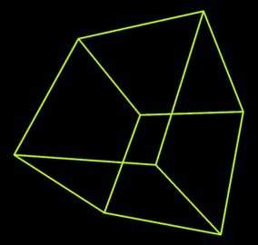
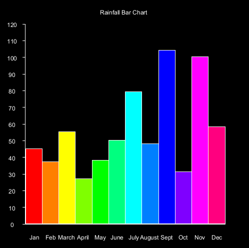
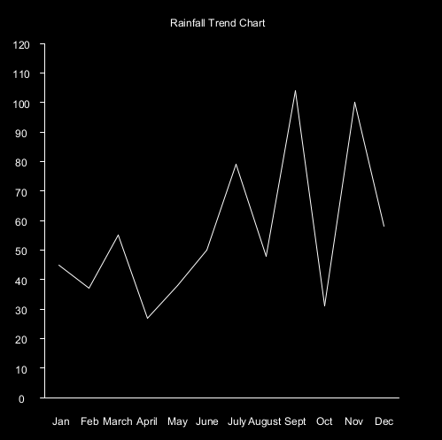
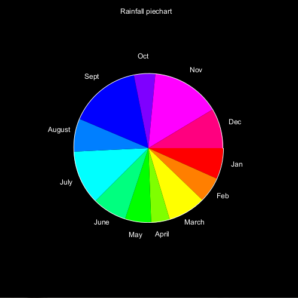
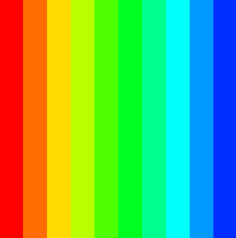
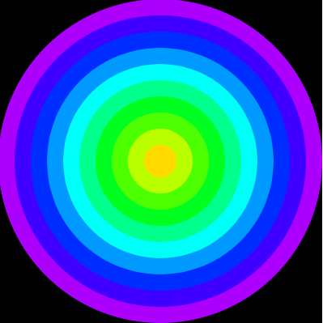
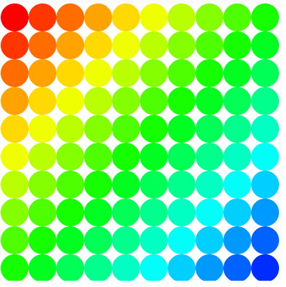
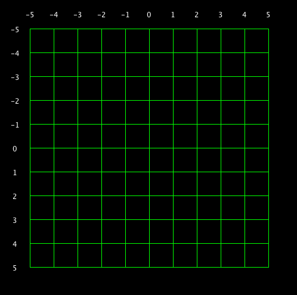

# TU856/TU858 Object Oriented Programming 2024



Resources
---------
- [Discord](https://discord.gg/XmNCFA8TAt)
- [Install the software you will need for this module](install.md)
* [Games Fleadh](http://www.gamesfleadh.ie/)
* [The git manual - read the first three chapters](http://git-scm.com/documentation)
* [A video tutorial all about git/github](https://www.youtube.com/watch?v=p_PGUltnB6w)
* [The Processing language reference](http://processing.org/reference/)
- [git reference](https://github.com/skooter500/csresources/blob/master/git_ref.md)

## Contact the lecturer
* Email: bryan.duggan@tudublin.ie
* Web: http://bryanduggan.org

## Assignments
- [Assignments](assignments.md)

# Week 5 - The Game of Life

- [Recording](https://tudublin-my.sharepoint.com/:v:/g/personal/bryan_duggan_tudublin_ie/ESxsrjKyYotPs8aVyO_e-IIBlfGXREkU5knLVp34NzChBA?nav=eyJyZWZlcnJhbEluZm8iOnsicmVmZXJyYWxBcHAiOiJTdHJlYW1XZWJBcHAiLCJyZWZlcnJhbFZpZXciOiJTaGFyZURpYWxvZy1MaW5rIiwicmVmZXJyYWxBcHBQbGF0Zm9ybSI6IldlYiIsInJlZmVycmFsTW9kZSI6InZpZXcifX0%3D&e=TSrJrj)
- [Epic Conway's Game of Life](https://www.youtube.com/watch?v=C2vgICfQawE)
- [3D Game of Life](https://www.youtube.com/watch?v=dQJ5aEsP6Fs)
- [John Conway talks about the game of life](https://www.youtube.com/watch?v=FdMzngWchDk)
- [The Dream of Life](https://www.youtube.com/watch?v=wU0PYcCsL6o)
- [The Nature of Code](https://natureofcode.com/)
- [A New Kind of Science](https://writings.stephenwolfram.com/2017/05/a-new-kind-of-science-a-15-year-view/)
- [Starting patterns](https://en.wikipedia.org/wiki/Conway%27s_Game_of_Life)

## Lab
### Learning Outcomes
- How to implement the logic of an algorithm
- How cellular automata works
- Writing java code
- Understanding how to visualise the contents of a 2D array
- Iterate over a 2D array

Accept [this assignment](https://classroom.github.com/a/zHeLIhVL). Clone the repo you are given, do the work below, commit and push your changes before Friday @ midnight.

Implement the missing parts of the Game of Life sp that your simulation looks like this:

[](https://www.youtube.com/watch?v=SmH2r_ChmFY)

Some extra things you can implement:

- Increase size and change the size of the screen and see what effect this has on the simulation 
- Press space to pause and resume the simulation
- Press 1 to randomise the board again
- Press 2 to clear the board
- Press 3 to draw a cross shape and see how it evolves
- Drag the mouse across the window to set cells at the mouse position to be alive.
- Draw a glider at the mouse position. This is starting pattern that will evolve a pattern that walks across the screen
- Draw a Gosper Gun at the mouse position. This is a starting pattern that will spawn creatures indefinitely
- Implement the [cell coloring algorithm](https://jimblackler.net/blog/?p=384)! This code will allow you to calculate the average of the 2 surrounding cell colors.

```Java
public float averageAround(float[][] board, int row, int col)
    {
        float xsum = 0;
        float ysum = 0;
        for(int r = row - 1; r <= row + 1 ; r ++)
        {
            for(int c = col - 1 ; c <= col + 1 ; c++)
            {
                float color = getCell(board, r, c);
                if (!(r == row && c == col) && color != -1)
                {
                    
                    float angle = map(color , 0, 255, -PI, PI);
                    xsum += cos(angle);
                    ysum += sin(angle);
                }
            }
        }

        xsum /= 3.0f;
        ysum /= 3.0f;

        return map(atan2(ysum, xsum), -PI, PI, 0, 255);
    }
```

[](https://www.youtube.com/watch?v=HMYh4jKdtNU)

# Week 4 - Arrays
- [Recording](https://tudublin-my.sharepoint.com/:v:/g/personal/bryan_duggan_tudublin_ie/EVvqKnadwxRHiFqi5a1BIGABb1_vjPamd3rVu-U5ggrhfg?nav=eyJyZWZlcnJhbEluZm8iOnsicmVmZXJyYWxBcHAiOiJTdHJlYW1XZWJBcHAiLCJyZWZlcnJhbFZpZXciOiJTaGFyZURpYWxvZy1MaW5rIiwicmVmZXJyYWxBcHBQbGF0Zm9ybSI6IldlYiIsInJlZmVycmFsTW9kZSI6InZpZXcifX0%3D&e=s8PPg6)

## Lab
## Learning Outcomes
- Iterate over an array using for loop
- How to visualise elements
- Map values in a dataset onto screen coordinates 
- Improved computational thinking skills
- Learn Java syntax

Accept [this assignment on Githuib classroom](https://classroom.github.com/a/4RR3vwmf). Clone the repo. Attempt the exercises and make 5 commits. Feel free to play with hue and saturation in addition to hue. Share pictures on Discord! They are really great and so impressive.

Check out this video of the assignment I wrote in GWBasic for the statistics module in first year WMT in Kevin St in 1990 (click the image for video):

[](https://www.youtube.com/watch?v=p3Vui6q_wPw)

And here is the [source code](https://github.com/skooter500/StatsAssignment). It's the early work of the word's greatest computer scientist. 

Inspired by the video, write code to generate graphs of the rainfall data. Start with the file Arrays.java. You will find these *much easier* if you use the [map function](https://processing.org/reference/map_.html)

Ensure your code works, if you change the drawing window size, or the array values.

- A bar chart (Easy):

  

  Start by drawing the axis, then draw the ticks and print the text, then draw the bars. You can use ```textAlign(CENTER, CENTER)``` to align the text
  Use the HSB color space to assign different colors to each bar

- A trend line (Medium)

	

  This one is a bit trickier, because you have to calculate the start xy, and end xy for each line. Your for loop for drawing the trend lines can start at 1 instead of 0, and then you can get the previous value for the start of each line by taking rainfall[i - 1].

- A pie chart (Hard)

	

	You can use the the [arc function](https://processing.org/reference/arc_.html) to draw arcs, and sin & cos to calculate the x and y coordinates to print the text. This one is the most challenging. Remember that a pie chart shows the proportion of each data point in the sum of all the data, so you will have to calculate the sum of all the rain fall and figure out how much each month is relative to the sum. It's best to draw the segments first and then draw the labels. Your map function might look something like this:

	```Java
	float angle = map(rainfall[i], 0, sum, 0, TWO_PI);
	```

# Week 3 - Loops

No lecture because of bank holiday

## Lab

## Learning Outcomes
- Learn how to use the for loop in Java
- Improved problem solving ability
- Improved computational thinking skills

Share screenshots on discord PLEASE. Today we will make multisensory for loops. In other words, loops that stimulate our senses with colours, hues and sounds. 

Accept [this individual assignment on github classroom](https://classroom.github.com/a/nPZ7hH8r). Clone the repository locally and make at least 5 commits as you go. Put your code into MultiSensoryForLoops.java. Have the keys 0-9 switch the screen to each of the patterns below. The color space is set to HSB and the color values correspond to hue (color), saturation (amount of gray) and brigtness. Use the [Processing reference](https://processing.org/reference/). Use mouseX, mouseY, width and height variables. 











Use line, sin and cos to draw regular polygons like squares, pentagons, octogons etc:


Bonus!

Make your patterns interactive with the mouse.

Use a for loop to play a sequence of tones at different pitches. This [article explains how](https://code.compartmental.net/minim/audiooutput_method_playnote.html). 

# Week 2 - Java Fundamentals & Drawing

## Lecture
- [Recording](https://tudublin-my.sharepoint.com/:v:/g/personal/bryan_duggan_tudublin_ie/EfYGCKGcbGxBpd_CoVMy5WUB3vmTjCm_uAVa_1w7iMMzqw?nav=eyJyZWZlcnJhbEluZm8iOnsicmVmZXJyYWxBcHAiOiJTdHJlYW1XZWJBcHAiLCJyZWZlcnJhbFZpZXciOiJTaGFyZURpYWxvZy1MaW5rIiwicmVmZXJyYWxBcHBQbGF0Zm9ybSI6IldlYiIsInJlZmVycmFsTW9kZSI6InZpZXcifX0%3D&e=wUe3Ng)

## Lab
## Learning Outcomes
- Practice drawing stuff and working out co-ordinates
- Practice using variables and if statements in Java

Share screenshots on discord PLEASE. BugZap was a game for the BBC Micro around 40 years ago, today YOU will recreate it. Just get as much as you can working in a couple of hours and commit as you are going along. Work together and help each other! Work in a group if you want to combine your work and get practice with git.

This is a video of a game the game made in Java using the Processing libraries. 

[](https://www.youtube.com/watch?v=s6PA8jtWneQ)

How you should do it:

- Accept [the assignment](https://classroom.github.com/a/DGPd3gkL) on github classroom.
- Clone the repo onto each team members computer
- Each team member make commits as you are working along

Ok let's get the main game working first and not worry about the splash screen and the game over screen

- There is a class called BugZap.java. Thats where you will be working today 
- Make sure everything works by compiling and running your program before continuing!

Now we can draw the bug.

- Make fields of type ```float``` in the BugZap class for ```playerX```, ```playerY``` and ```playerWidth``` and give these default values. You can decide what these should be. There are built in variables called ```width``` and ```height``` that give the width and height of the drawing window. These only get assigned after size has been called, so if you want to use these to give values to playerX, playerY etc. put the code into the *setup* method. 
- Write a method called void ```void drawPlayer(float x, float y, float w)``` that draws the player character, centered around the parameters x, y. You can use the line method to do this. You can pass variables as parameters to this method and also things like ```x + 20```, ```w * 0.5f``` etc. I made an extra variable in this method called h for the height and set it to be half the w parameter. Don't forget to set the stroke color!
- Call this method from ```draw```, passing in the parameters playerX, playerY and playerWidth.
- Compile and run everything to make sure it's working before continuing.
- If everything is working ok, you should see the bug on the screen

Now lets get the player moving in response to the keys

```Java
public void keyPressed()
	{
		if (keyCode == LEFT)
		{
			System.out.println("Left arrow pressed");
		}
		if (keyCode == RIGHT)
		{
			System.out.println("Right arrow pressed");
		}
		if (key == ' ')
		{
			System.out.println("SPACE key pressed");
		}
	}	
```

- If you compile and run the program again you will see that some messages get printed out when you press various keys. If you are running in Visual Studio Code, you will see these messages appear in the Debug Console
- Modify this method to increment and decrement the playerX variable instead and you should be able to get the player to move left and right
- You might want to add if statements to this method to stop the player moving off the left and right side of the screens. If statements in Java are almost the same as in C!
- When the player presses SPACE you will want to draw a line for the player's laser.

The Bug

- In a similar way to how you made the player, make the Bug. Make variables and drawBug method. Don't forget to call the method from draw()
- To move the bug you can add a random amount to it's x coordinate on intervals. To generate a random number you can use the [random](https://processing.org/reference/random_.html) function.  
- One way to make stuff happen on an interval rather than every frame is to use the frameCount variable. This variable is a field in PApplet and it gets incremented automatically every time draw is called. Because draw gets called 60 times a second, you can do something every second with this code:

```Java
if ((frameCount % 60) == 0)
{
    // Do something
}
```

- You can print text to the screen using the [text](https://processing.org/reference/text_.html) function.

Ok you should now have the basics working. See if you can figure out how to check to see if the player hits the bug, add scoring, splash screen, game over screen and sound.

# Week 1 - Introduction

## Lecture
- [Introduction Slides](https://tudublin-my.sharepoint.com/:p:/g/personal/bryan_duggan_tudublin_ie/EYXKcGlJFllBoLfJ_GjdH8ABu2OQCKyRsXuqlPqb3yXMtA?e=7hN0YC)

- [Class](https://tudublin-my.sharepoint.com/:v:/g/personal/bryan_duggan_tudublin_ie/EUzKV4H1siFOiSsI8Hv6teUBNBW_aols8cnkJN_MYskBYw?e=nJXD7A&nav=eyJyZWZlcnJhbEluZm8iOnsicmVmZXJyYWxBcHAiOiJTdHJlYW1XZWJBcHAiLCJyZWZlcnJhbFZpZXciOiJTaGFyZURpYWxvZy1MaW5rIiwicmVmZXJyYWxBcHBQbGF0Zm9ybSI6IldlYiIsInJlZmVycmFsTW9kZSI6InZpZXcifX0%3D)

- [Tutorial](https://tudublin-my.sharepoint.com/:v:/g/personal/bryan_duggan_tudublin_ie/Eao2ORq7PZxDlO6P8g_3-iABtftptjpFfvj0Z3xMS2z59Q?e=brnRWG&nav=eyJyZWZlcnJhbEluZm8iOnsicmVmZXJyYWxBcHAiOiJTdHJlYW1XZWJBcHAiLCJyZWZlcnJhbFZpZXciOiJTaGFyZURpYWxvZy1MaW5rIiwicmVmZXJyYWxBcHBQbGF0Zm9ybSI6IldlYiIsInJlZmVycmFsTW9kZSI6InZpZXcifX0%3D)

## Tutorial
- [Coding Bat](https://codingbat.com/)

## Lab
## Learning outcomes
- Set up Java, Visual studio code and the Java Extensions
- Fork the repo, configure the upstream remotes
- Write your first Java Program
- Test out Github classroom

## Part 1 - Setup Java, forking and cloning

Install the software you will need for this module and set up your path to the Java Development Kit. [This document explains what you need](install.md).

Fork this repository by clicking the fork button above, so that you get your own copy of the course repo to work on this semester. Now create a new empty folder on your computer somewhere right click on the folder and choose git bash here. Alternatively you can start the bash and cd to the new folder. To clone the repository for your fork:

```bash
git clone https://github.com/YOURGITUSERNAME/OOP-2024
```

Replace YOURGITUSERNAME with your github username. You can also copy the URL to the repo from your browser and paste it into the console. To paste into the bash on Windows is right click. You can use Cmd + C, Cmd + V on the Mac.

Now cd into the repo and check the origin and upstream remotes are set up correctly

```bash
cd OOP-2024
git remote -v
```

You should see something like this:

```bash
origin  https://github.com/YOURGITUSERNAME/OOP-2024 (fetch)
origin  https://github.com/YOURGITUSERNAME/OOP-2024 (push)
upstream  https://github.com/skooter500/OOP-2024 (fetch)
upstream  https://github.com/skooter500/OOP-2024 (push)
```

If you don't see the upstream remote, you can set it up by typing

```bash
git remote add upstream https://github.com/skooter500/OOP-2024
```
You can read more about forking a git repository and setting up the upstream remote in [this article](https://help.github.com/en/github/getting-started-with-github/fork-a-repo)

Once the upstream is setup, you will be able to push code to your own repo and also keep it up to date with the master branch of the changes I make each class.

If you already forked the repo before the lab, you may need to update your master branch from my master branch to get the changes I made:

```bash
git fetch
git checkout master
git pull upstream master
git push
```

Open the OOP-2024 folder in Visual Studio Code. You can run your program by choosing Run | Start Debugger. *Important for users of the Lab computers* In the labs you should use the shell scripts ```compile.sh``` and ```run.sh``` located in the Java folder to compile and run your code. You can run these from the Bash. 

You should see

```
Hello world
Woof. I am Misty
Woof. I am Lucy
cats are from space
```
Congratulations! You have successfully compiled and run your first Java program. 

## Part 2

Accept [this assignment on Github classroom](https://classroom.github.com/a/5nyQb4Oa)

You can open it in Codespaces or clone the repo and open on your computer. 

Submit your solution by doing a commit

- Create a Cat class
- Make a private ```int``` field on the Cat class called numLives.
- Write public accessors for the field (see how I did this for the name field on the Animal class)
- Set the value of this field to 9 in the Cat constructor  
- Write a method (functions are called methods in Java) on the Cat class called kill. It should subtract 1 from numLives if numLives is > 0 and print the message "Ouch!". If numLives is 0, you should just print the message "Dead"
- Create a new instance of the Cat class like this

    ```Java
    Cat ginger = new Cat("Ginger");
    ```
- In the Main class in a loop, call kill on ginger until ginger is dead.
- Compile and run your program until you have no bugs and you get the desired output.

Commit and push your changes:

```bash
git add .
git commit -m "killing the cat"
git push
```